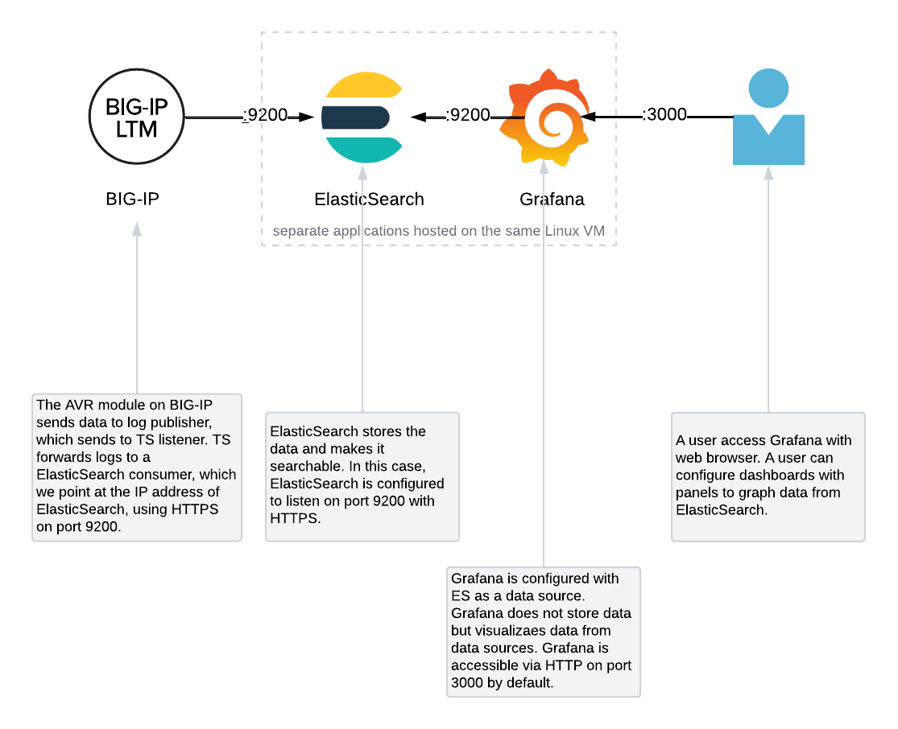

# udf-grafana-elasticsearch

This repo contains files used the build an environment where BIG-IP AVR data can be sent to ElasticSearch and visualized using Grafana.

## Overview of architecture

## Grafana UI

